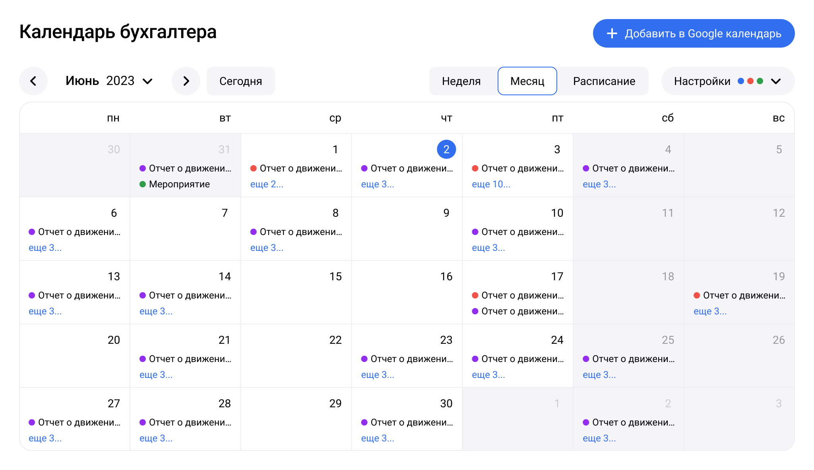

![[calendar.png|600]]

#### Верхняя часть

[AccountingCalendarTimeSelector](TimeSelector/TimeSelector.md)

[AccountingCalendarBodySelector](BodySelector.md)

[AccountingCalendarSettings](Settings/Settings.md)

#### Тело

[AccountingCalendarBodyWeek](Body/Week.md)

[AccountingCalendarBodyMonth](Body/Month.md) *(default)*

[AccountingCalendarBodySchedule](Body/Schedule.md)

[AccountingCalendarBodyMobile](AccountingCalendar/Body/Mobile/Mobile.md)

