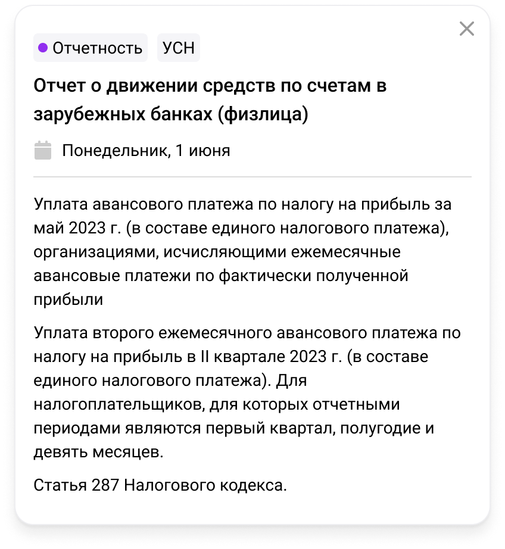
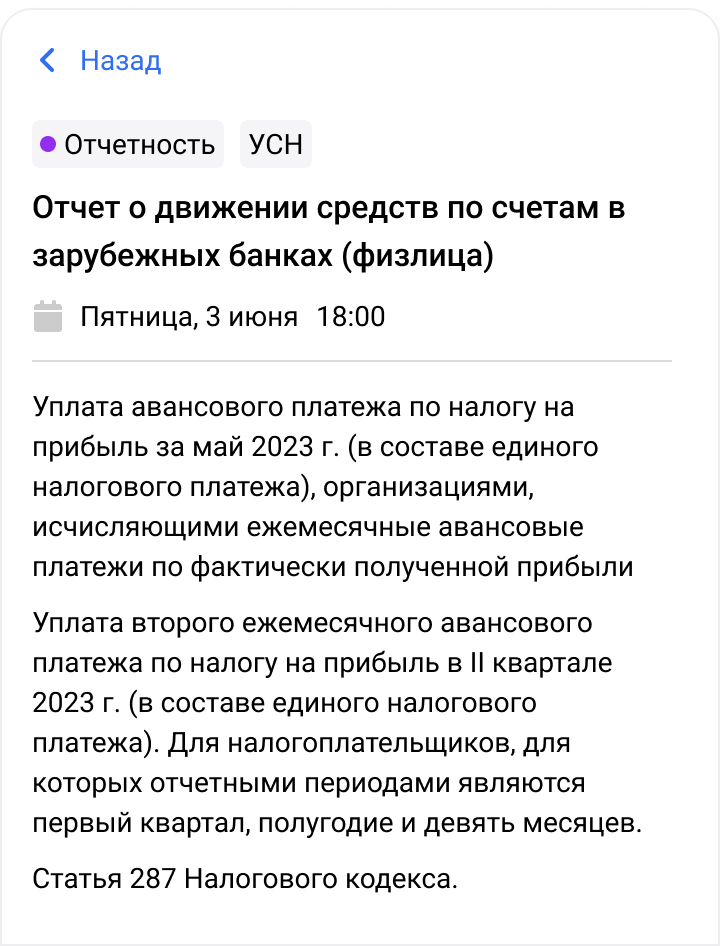

Parents:
[AccountingCalendarBodyWeek](Week.md)

[AccountingCalendarBodyMonth](Month.md)

[AccountingCalendarBodySchedule](Schedule.md)

[AccountingCalendarBodyMobileDay](Mobile/Day.md)

![[event.png|350]]

Компонент рисует данные одного выбранного эвента.

---

#### mobile

![[event_mobile.png|300]]

