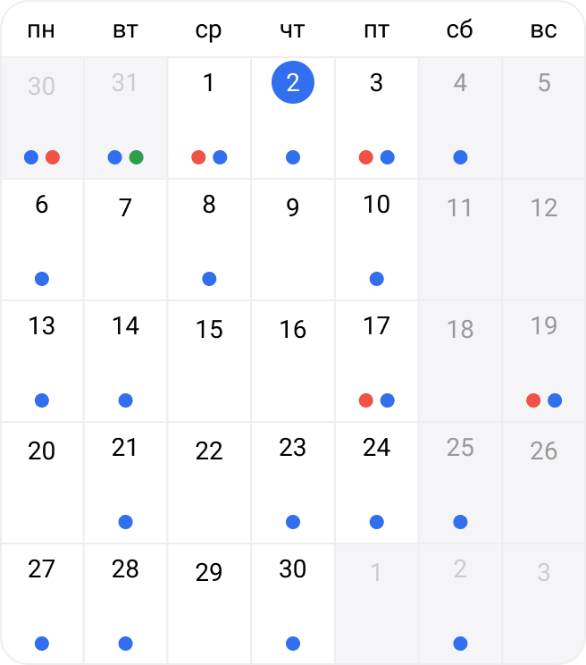

Parent: [AccountingCalendar](AccountingCalendar.md)

![[mobile_body.png|300]]

[AccountingCalendarDate](Date.md)

[AccountingCalendarMarker](../../Marker.md)

BaseModal > [AccountingCalendarBodyMobileDay](Day.md)

BaseModal > [AccountingCalendarBodyEvent](Event.md)

BaseModal > [AccountingCalendarSettings](Settings.md)

Месяц, неделю и расписание, a также мобильную версию основной таблицы разбиваем на компоненты просто для того, чтобы не было загруженности стилей в одном компоненте