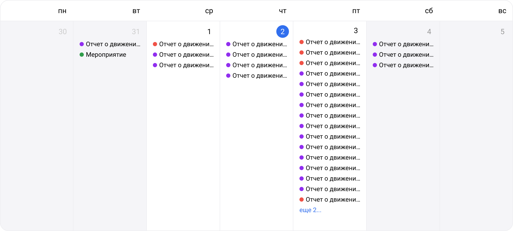

Parent: [AccountingCalendar](../AccountingCalendar.md)

![[week.png|600]]

[AccountingCalendarBodyEvent](Event.md)

[AccountingCalendarMarker](../Marker.md)

Месяц, неделю и расписание, a также мобильную версию основной таблицы разбиваем на компоненты просто для того, чтобы не было загруженности стилей в одном компоненте