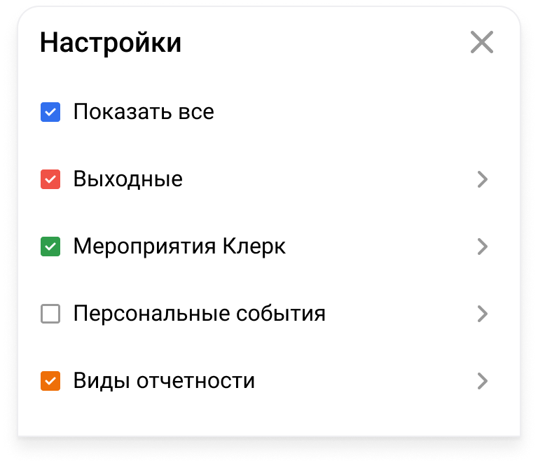

Parent: [AccountingCalendarSettings](Settings.md)

![[settings_layer_one.png|300]]

![[settings_layer_two.png|300]]

BaseModal >  UiDropDownMenuNoScroll

BaseModal >  UiDropDownMenu

Эмитит обьект фильтров с выбранными данными при закрытии.