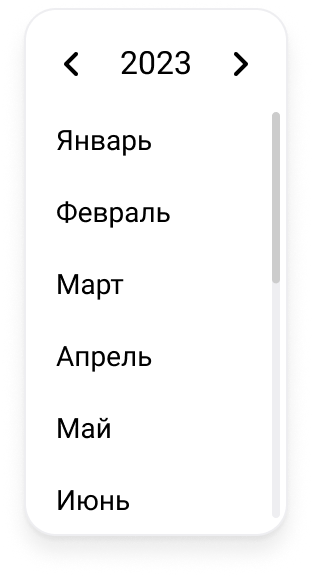
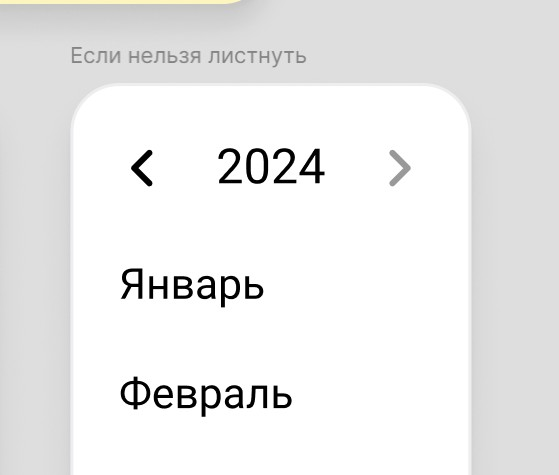
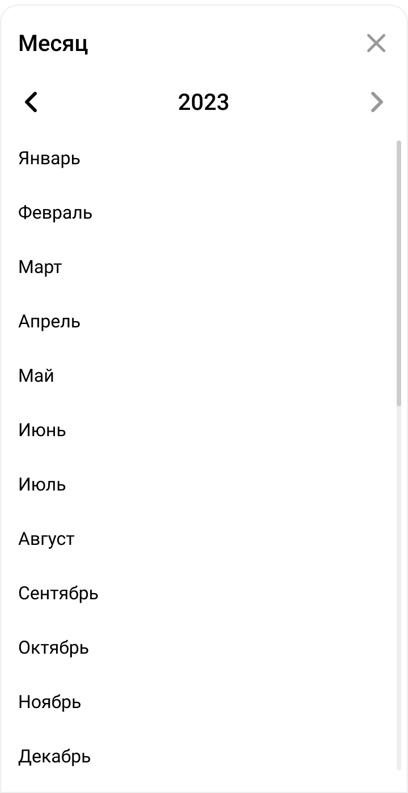

Parent: [AccountingCalendarTimeSelector](TimeSelector.md)

![[month_selector.png|200]]

Эмитит текущий месяц.

---

Есть состояние ограничивающее перелистывание вперед. Предлагаю ограничивать следующим годом.

![[max_date.jpg|300]]

---

На мобилке:

![[month_selector_mobile.png|300]]

