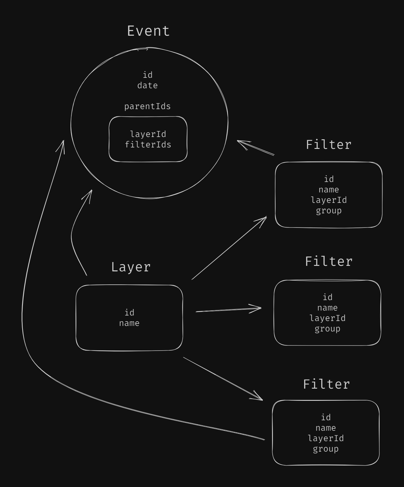

#### Начальный запрос справочников

```
v4/calendar-info 
```

```ts
{
  layers: {
    1: 'Выходные',
    2: 'Мероприятия Клерк',
    3: 'Персональные события',
    4: 'Отчетность',
  },
  filters: [
    { id: 1, name: 'Вебинары', layerId: '2', group: null },
    { id: 2, name: 'Онлайн-курсы', layerId: '2', group: null },
    { id: 3, name: 'Курсы повышения квалификации', layerId: '2', group: null },
    {
      id: 4,
      name: 'Бухгалтерская и налоговая',
      layerId: '4',
      group: 'Виды отчетности',
    },
    { id: 5, name: 'По сотрудникам', layerId: '4', group: 'Виды отчетности' },
    { id: 6, name: 'Статистическая', layerId: '4', group: 'Виды отчетности' },
    { id: 7, name: 'Экологическая', layerId: '4', group: 'Виды отчетности' },
    { id: 8, name: 'Алкогольная', layerId: '4', group: 'Виды отчетности' },
    { id: 9, name: 'ПФР', layerId: '4', group: 'Контролирующий орган' },
    { id: 10, name: 'РПН', layerId: '4', group: 'Контролирующий орган' },
    { id: 11, name: 'ФНС', layerId: '4', group: 'Контролирующий орган' },
    { id: 12, name: 'ФСС', layerId: '4', group: 'Контролирующий орган' },
    { id: 13, name: 'ФСРАР', layerId: '4', group: 'Контролирующий орган' },
    { id: 14, name: 'СФР', layerId: '4', group: 'Контролирующий орган' },
    { id: 15, name: 'ОСНО', layerId: '4', group: 'Система налогооблажения' },
    { id: 16, name: 'УСН', layerId: '4', group: 'Система налогооблажения' },
    { id: 17, name: 'ПСН', layerId: '4', group: 'Система налогооблажения' },
    { id: 18, name: 'ЕСХН', layerId: '4', group: 'Система налогооблажения' },
  ],
}
```

При добавлении новых слоев и фильтров лучше вегда использовать новые id'шники, даже если есть пропущенные числа после удаления старых, т.к. состояние выбранных слоев может быть сохранено у пользователя в ссылке

---
#### Последующий запрос эвентов

```
v4/calendar-events
```

```
start = 2024-04-29
end = 2024-06-02
layerIds = 1,2,3 // необязательный параметр
filterIds = 1,2,3,4,5 // необязательный параметр
```

При отсутствии параметров фильтрации присылаются все эвенты в указанном диапазоне дат

```
v4/calendar-events?start=2024-04-29&end=2024-06-02&layerIds=1,2,3&filterIds=1,2,3
```

```ts
[
  // Выходные
  {
    date: '2024-06-15',
    name: '',
    description: '',
    parentIds: { layerId: '1', filterIds: [] },
  },
  {
    date: '2024-06-16',
    name: '',
    description: '',
    parentIds: { layerId: '1', filterIds: [] },
  },
  {
    date: '2024-06-22',
    name: '',
    description: '',
    parentIds: { layerId: '1', filterIds: [] },
  },
  {
    date: '2024-06-23',
    name: '',
    description: '',
    parentIds: { layerId: '1', filterIds: [] },
  },
  // Мероприятия Клерк
  {
    date: '2024-07-10',
    name: 'Вебинар',
    description: 'Описание вебинара',
    parentIds: { layerId: '2', filterIds: ['1'] },
  },
  {
    date: '2024-07-12',
    name: 'Курс повышения квалификации',
    description: 'Описание курса повышения квалификации',
    parentIds: { layerId: '2', filterIds: ['3'] },
  },
  // Персональные события
  {
    date: '2024-06-15',
    name: 'Название персонального события',
    description: 'Описание персонального события',
    parentIds: { layerId: '3', filterIds: [] },
  },
  // Oтчетность
  {
    date: '2024-06-07',
    name: 'Название отчета',
    description: 'Относится ко отчетности по сотрудникам, орган ПФР и ФНС',
    parentIds: { layerId: '4', filterIds: ['5', '9', '11'] },
  },
]
```

Совпадение по фильтрам должно быть строгим, эвент присылается, только если все фильтры эвента указаны в запросе. А вот в случае, если эвент не относится ни к одному фильтру ( пустой filterIds: [] ) - достаточно совпадения по слою - эвент присылается

---

![[excali_scheme_03.png|600]]



![[layers_filters.png|500]]


![[layers_groups_filters.png|700]]


Группы могут показаться родительской сущностью по отношению к фильтрам, но на самом деле они лишь собирают фильтры вместе по теме для отображения по столбцам. Группа - характеристика фильтра

---

- [Дорожная карта](road_map.md)

- [Вопросы](questions.md)

- [Старая структура](old_structure.md)

- [Старое ридми 01](old_readme_01.md)

* [Вариант Николая](nikolai.md)
