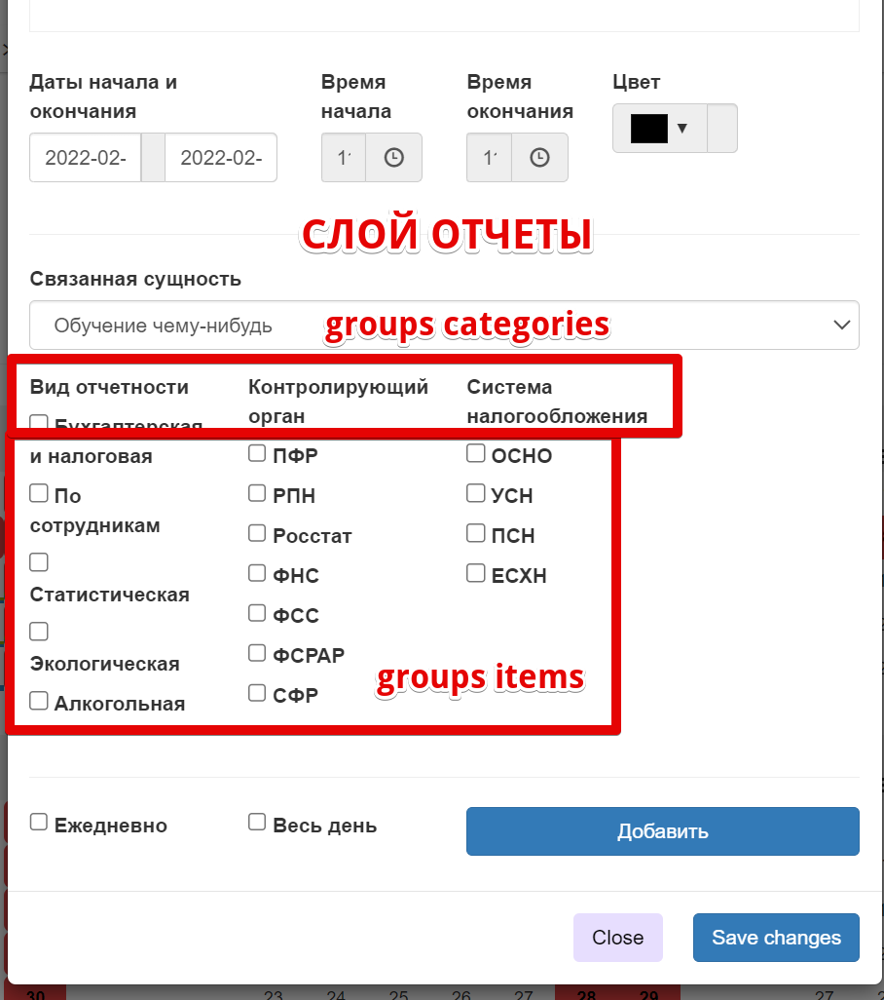

#### Начальный запрос справочников

```
v4/calendar-info 
```

```
fields = layers,groups
```

```
v4/calendar-info?fields=layers,groups
```

```ts
export type Info = {
  id: number
  title: string
}
export interface GroupsInfo extends Info {
  layerId: number
  catId: number | null
}
export type ResponseInfo = {
  layers: Info[]
  groups: {
    items: GroupsInfo[]
    categories: Info[]
  }
}
const responseInfo: ResponseInfo = {
  layers: [
    { id: 1, title: 'Выходные' },
    { id: 2, title: 'Мероприятия Клерк' },
    { id: 3, title: 'Персональные события' },
    { id: 4, title: 'Отчетность' },
  ],
  groups: {
    items: [
      { id: 1, layerId: 2, catId: null, title: 'Вебинары' },
      { id: 2, layerId: 2, catId: null, title: 'Онлайн-курсы' },
      { id: 3, layerId: 2, catId: null, title: 'Курсы повышения квалификации' },
      { id: 4, layerId: 4, catId: 1, title: 'Бухгалтерская и налоговая' },
      { id: 5, layerId: 4, catId: 1, title: 'По сотрудникам' },
      { id: 6, layerId: 4, catId: 1, title: 'Статистическая' },
      { id: 7, layerId: 4, catId: 1, title: 'Экологическая' },
      { id: 8, layerId: 4, catId: 1, title: 'Алкогольная' },
      { id: 9, layerId: 4, catId: 2, title: 'ПФР' },
      { id: 10, layerId: 4, catId: 2, title: 'РПН' },
      { id: 11, layerId: 4, catId: 2, title: 'ФНС' },
      { id: 12, layerId: 4, catId: 2, title: 'ФСС' },
      { id: 13, layerId: 4, catId: 2, title: 'ФСРАР' },
      { id: 14, layerId: 4, catId: 2, title: 'СФР' },
      { id: 15, layerId: 4, catId: 3, title: 'ОСНО' },
      { id: 16, layerId: 4, catId: 3, title: 'УСН' },
      { id: 17, layerId: 4, catId: 3, title: 'ПСН' },
      { id: 18, layerId: 4, catId: 3, title: 'ЕСХН' },
    ],
    categories: [
      { id: 1, title: 'Виды отчетности' },
      { id: 2, title: 'Контролирующий орган' },
      { id: 3, title: 'Система налогооблажения' },
    ],
  },
}
```

При добавлении новых слоев, групп и категорий лучше вегда использовать новые id'шники, даже если есть пропущенные числа после удаления старых фильтров, т.к. состояния фильтров могут быть сохранены у пользователя в ссылке

---
#### Последующий запрос эвентов

```
v4/calendar-events
```

```
startDate = 2024-04-29
endDate = 2024-06-02
layers = 1,2,3
groups = 1,2,3,4,5
```

```
v4/calendar-events?start=2024-04-29&end=2024-06-02&layers=1,2,3,4&groups=1,2,3,4,5
```

```ts
export type CalendarEvents = {
  layerId: number // хоть и фильтруем уже в запросе, id слоя нужен для цвета
  groupIds?: number[] // нужно для отображения группы в карточке события - "УСН"
  date: string // тип Date, но фетчится как string
  title?: string
  description?: string
}
const responseEvents: CalendarEvents[] = [
  { layerId: 1, date: '2024-06-15' },
  { layerId: 1, date: '2024-06-16' },
  { layerId: 1, date: '2024-06-22' },
  { layerId: 1, date: '2024-06-23' },
  {
    layerId: 2,
    groupIds: [1],
    date: '2024-06-10',
    title: 'Название вебинара',
    description: 'Описание вебинара',
  },
  {
    layerId: 2,
    groupIds: [3],
    date: '2024-06-12',
    title: 'Название курса повышения квалификации',
    description: 'Описание курса повышения квалификации',
  },
  {
    layerId: 3,
    date: '2024-06-15',
    title: 'Название персонального события',
    description: 'Описание персонального события',
  },
  {
    layerId: 4,
    groupIds: [5, 9, 11],
    date: '2024-06-07',
    title: 'Название отчета',
    description: 'Относится ко отчетности по сотрудникам, орган ПФР и ФНС',
  },
]
```

Фильтруем эвенты на бэке по layerId и groupsIds, указанным в параметрах API. Если указан слой без групп - возвращаем все эвенты слоя (например, выходные), в остальных случаях только эвенты указанных групп

---

![[layers_groups.png|650]]


![[groups_admin.png|450]]



---

Основной компонент: [AccountingCalendar](AccountingCalendar/AccountingCalendar.md) *(дерево компонентов в сайдбаре навигации)*

id и цвет слоя, задаем на фронте по макету
```ts
const colorLayerMap = {
  default: 'grey-500', // если не нашли id или не указан
  1: 'red-500',
  2: 'green-500',
  3: 'blue-500',
  4: 'yellow-500',
}
```


---

- [Дорожная карта](road_map.md)

- [Вопросы](questions.md)

- [Старая структура](old_structure.md)

- [Старое ридми 01](old_readme_01.md)
