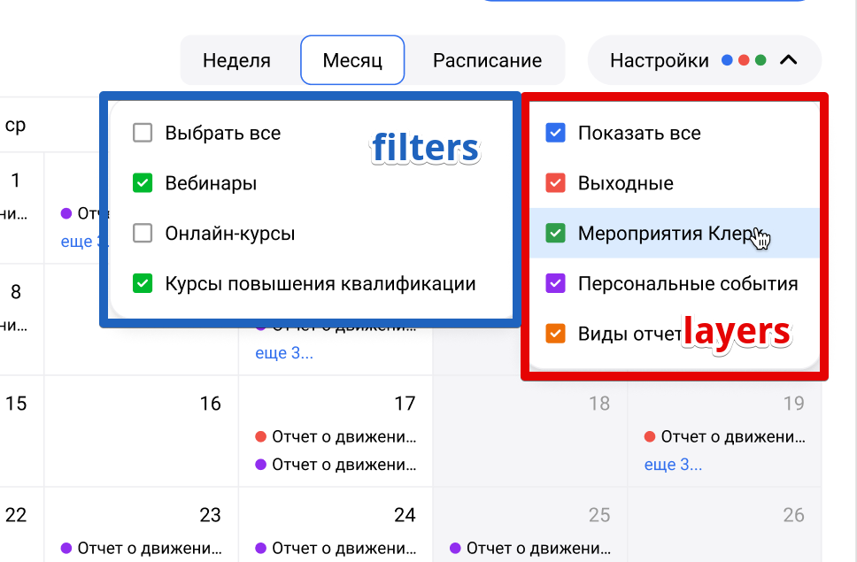
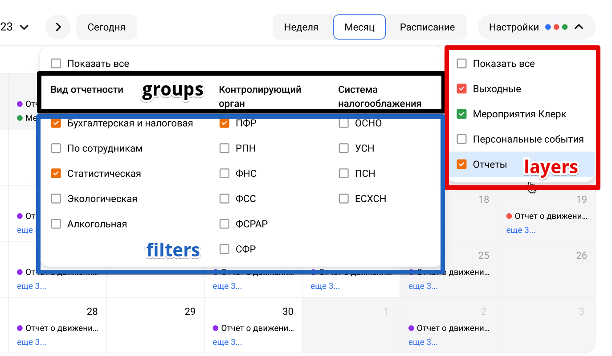

### Запрос информации о слоях и фильтрах

```
v4/calendar/info 
```
#### Ответ

```ts
{
  layers: {
    1: 'Выходные',
    2: 'Вебинары',
    4: 'Отчетность',
    5: 'Уплата налогов'
  },
  filters: [
    { id: 5, name: 'По сотрудникам', layerIds: [4, 5], group: 'Виды отчетности' },
    { id: 7, name: 'Экологическая', layerIds: [4], group: 'Виды отчетности' },
    { id: 8, name: 'Статистическая', layerIds: [4, 5], group: 'Виды отчетности' },
    { id: 9, name: 'ПФР', layerIds: [4], group: 'Контролирующий орган' },
    { id: 10, name: 'РПН', layerIds: [4], group: 'Контролирующий орган' },
    { id: 14, name: 'СФР', layerIds: [4, 5], group: 'Контролирующий орган' },
    { id: 17, name: 'ПСН', layerIds: [4, 5], group: 'Система налогооблажения' },
    { id: 18, name: 'ЕСХН', layerIds: [4], group: 'Система налогооблажения' },
  ],
}
```

При добавлении новых слоев и фильтров лучше вегда использовать новые id'шники, даже если есть пропущенные числа после удаления старых, т.к. состояние выбранных слоев может быть сохранено у пользователя в ссылке

---
### Запрос эвентов

```
v4/calendar/events
```
#### Параметры

Диапазон дат

```
start=2024-04-29&end=2024-06-02
```

Слои и фильры. Если есть слой, но значение не указано, то ни один фильтр не выбран - присылаются эвенты этого слоя только с пустым filterIds: []. Если в слое есть фильтры - присылаются только выбранные

```
1&2&5=6,14,17&4
```

#### Примеры

Если не указан ни один слой, только start и end даты, то присылаем вообще все эвенты в указанном диапазоне дат. Если на бэке такую проверку делать плохо, есть еще вариант с отдельным параметром `send_all`

```
v4/calendar/info?start=2024-04-29&end=2024-06-02
```

Присылаем 1, 2, 5 и 4-ый слой. У 1 и 2-го нет фильтров. У 5-го слоя выбраны 8 и 14-ый фильтры. У 4-го слоя не выбран ни один фильтр

```
v4/calendar/info?start=2024-04-29&end=2024-06-02&1&2&5=8,14&4
```

#### Ответ

```ts
[
  // Выходные
  {
    date: '2024-06-15',
    endDate: '',
    name: '',
    description: '',
    url: '',
    parentIds: { layerId: 1, filterIds: [] },
    attachments: []
  },
  {
    date: '2024-06-16',
    endDate: '',
    name: '',
    description: '',
    url: '',
    parentIds: { layerId: 1, filterIds: [] },
    attachments: []
  },
  // Вебинары
  {
    date: '2024-07-10',
    endDate: '',
    name: 'Вебинар',
    description: 'Описание вебинара',
    url: '/learn/event/50537/',
    parentIds: { layerId: 2, filterIds: [] },
    attachments: [
       { title: 'Вебинар Все про УСН', url: '/link/' },
       { title: 'Название документа', url: '/link/' }
    ]
  },
  // Oтчетность
  {
    date: '2024-06-07',
    endDate: '2024-06-15',
    name: 'Название отчета',
    description: 'Не относится ни к одному фильтру',
    url: '',
    parentIds: { layerId: 4, filterIds: [] },
    attachments: []
  },
  // Уплата налогов
  {
    date: '2024-06-09',
    endDate: '',
    name: 'Название уплаты налогов',
    description: 'Относится к СФР',
    url: '',
    parentIds: { layerId: 5, filterIds: [14] },
    attachments: []
  }
]
```

Эвент с пустым filterIds: [] не относится ни к одному фильтру и присылается даже в запросе у слоя не выран ни один фильтр - достаточно самого совпадения по слою

---

![[layers_filters.png|500]]



![[layers_groups_filters.png|700]]



Группы могут показаться родительской сущностью по отношению к фильтрам, но на самом деле они лишь собирают фильтры вместе по теме для отображения по столбцам. Группа - характеристика фильтра

---

- [Дорожная карта](road_map.md)

- [Вопросы](questions.md)

- [Старая структура](old_structure.md)

- [Старое ридми 01](old_readme_01.md)

* [Вариант Николая](nikolai.md)
