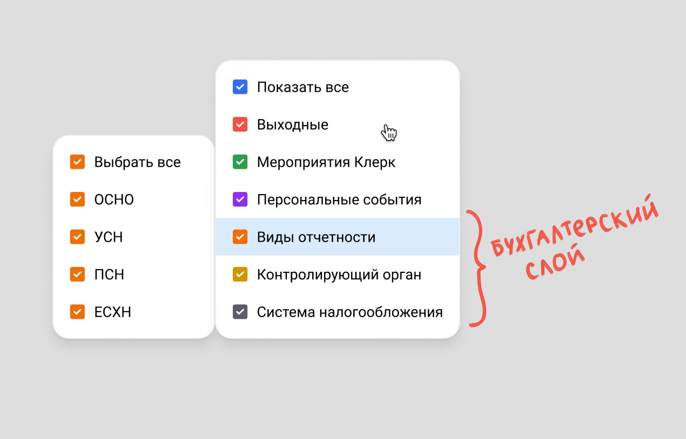
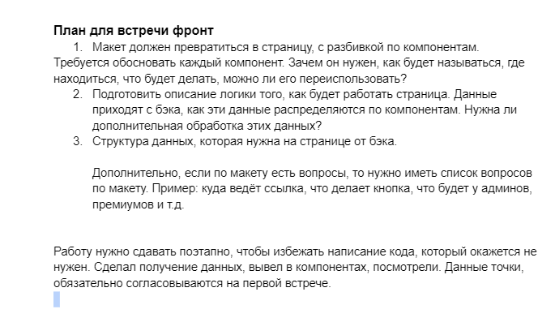

Основной компонент: [AccountingCalendar](AccountingCalendar/AccountingCalendar.md) *(дерево компонентов в сайдбаре навигации)*

---
#### Основные типы

```ts
// Памятка на фронте, чтобы понимать, какие слои запрашиваем
// 1: Выходные
// 2: Мероприятия Клерк
// 3: Персональные события
// 4: Бухгалтерские события

// так выглядит адрес фронта с фильтрами
// /...calendar?filters=1,[3,[1,[2,[1,3]]]]

type Filter = {
  id: number
  title: string
  filters?: Filter[]
}

interface Layer extends Filter {
  // по умолчанию слой тоже фильтр, если игнорируем, то на первый уровень
  // фильтрации сразу подставляются дочерние фильтры
  ignoreLayerFilter?: boolean
  events?: LayerEvent[]
}

type LayerEvent = {
  date: string // тип Date, но фетчится как string
  title?: string
  description?: string
  selectedFilters?: SelectedFilters[]
}

// либо только id фильтрa, тогда событие относится ко всему фильтру целиком
// либо id фильтра и массив конфигураций дочерних фильтров
type SelectedFilters = number | [number, SelectedFilters[]]
```


> ignoreLayerFilter

По умолчанию слой тоже фильтр, если игнорируем, то на первый уровень фильтрации сразу подставляются дочерние фильтры

![[buh_layer.jpg|600]]



---
#### API

Основной адрес API
```
v4/accounting-calendar
```

Параметры API
```
startDate = "2024-04-29"
endDate = "2024-06-02"
```

Запрашиваем с бэка v4/accounting-calendar?layers=1,2,3,4
```ts
const response: Layer[] = [
  {
    id: 1,
    title: 'Выходные',
    events: [
      { date: '2024-06-15' },
      { date: '2024-06-16' },
      { date: '2024-06-22' },
      { date: '2024-06-23' },
    ],
  },
  {
    id: 2,
    title: 'Мероприятия Клерк',
    filters: [
      { id: 1, title: 'Вебинары' },
      { id: 2, title: 'Онлайн-курсы' },
      { id: 3, title: 'Курсы повышения квалификации' },
    ],
    events: [
      {
        date: '2024-06-10',
        title: 'Название вебинара',
        description: 'Описание вебинара',
        selectedFilters: [1],
      },
      {
        date: '2024-06-12',
        title: 'Название курса повышения квалификации',
        description: 'Описание курса повышения квалификации',
        selectedFilters: [3],
      },
    ],
  },
  {
    id: 3,
    title: 'Персональные события',
    events: [
      {
        date: '2024-06-15',
        title: 'Название персонального события',
        description: 'Описание персонального события',
      },
    ],
  },
  {
    id: 4,
    title: 'Бухгалтерские события',
    ignoreLayerFilter: true,
    filters: [
      {
        id: 1,
        title: 'Виды отчетности',
        filters: [
          { id: 1, title: 'Бухгалтерская и налоговая' },
          { id: 2, title: 'По сотрудникам' },
          { id: 3, title: 'Статистическая' },
          { id: 4, title: 'Экологическая' },
          { id: 5, title: 'Алкогольная' },
        ],
      },
      {
        id: 2,
        title: 'Контролирующий орган',
        filters: [
          { id: 1, title: 'ПФР' },
          { id: 2, title: 'РПН' },
          { id: 3, title: 'ФНС' },
          { id: 4, title: 'ФСС' },
          { id: 5, title: 'ФСРАР' },
          { id: 6, title: 'СФР' },
        ],
      },
      {
        id: 3,
        title: 'Система налогооблажения',
        filters: [
          { id: 1, title: 'ОСНО' },
          { id: 2, title: 'УСН' },
          { id: 3, title: 'ПСН' },
          { id: 4, title: 'ЕСХН' },
        ],
      },
    ],
    events: [
      {
        date: '2024-06-07',
        title: 'Название бухгалтерского события',
        description: 'Относится ко всем видам отчетности, орган ПФР и ФНС',
        selectedFilters: [1, [2, [1, 3]]],
      },
    ],
  },
]
```

id и цвет слоя, задаем на фронте по макету
```ts
const colorLayerMap = {
  1: 'red-500',
  2: 'green-500',
  3: 'blue-500',
  4: 'yellow-500',
}
```


---
#### id

Поле **id** используется для сохранения состояния фильтров, апи запросов на бэк, и в адресной строке на фронте для сохранения фильтров

```ts
type Filter = {
  id: number
  title: string
  ...
}

{
  id: 2,
  title: "Мероприятия Клерк"
  ...
}
  
// так выглядит адрес фронта с фильтрами
".../calendar?filters=1,[3,[1,[2,[1,3]]]]"
```

Как вариант вместо числовых id - строки на английском:

```ts
type Layer = {
  token: string // или также id но string
  title: string
  ...
}

{
  token: "klerkEvents",
  title: "Мероприятия Клерк"
  ...
}

// так выглядит адрес фронта с фильтрами
".../calendar?filters=dayOff,[buhEvents,[reportTypes,[ecology,alcogol]]"
```

При добавлении новых фильтров лучше вегда использовать новые id'шники, даже если есть пропущенные числа после удаления старых фильтров, т.к. состояния фильтров могут быть сохранены у пользователей в ссылке

---

[вопросы](questions.md)

[старая структура](old_structure.md)

---
#### Дорожная карта втреч

1:
- формат данных по апи
- структура компонентов

2:
- фетчинг / обработка данных
- прокидывание данных по компонентам / пропсы компонентов


![[rules.png|550]]


