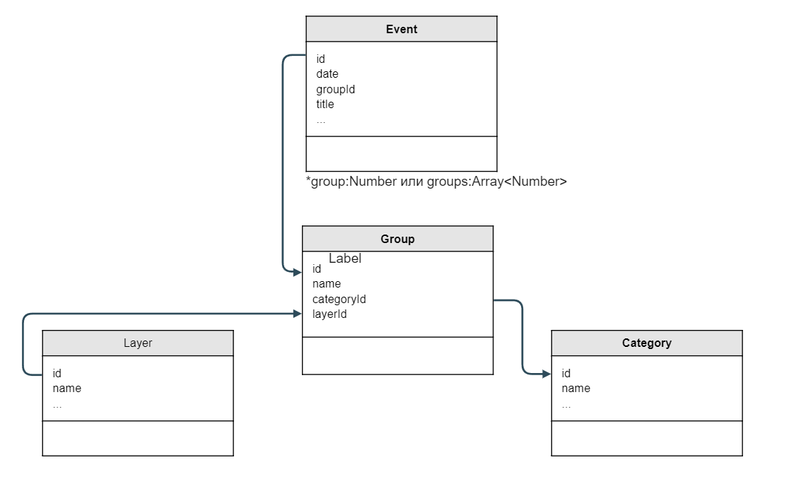
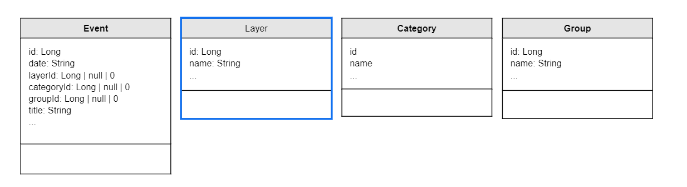
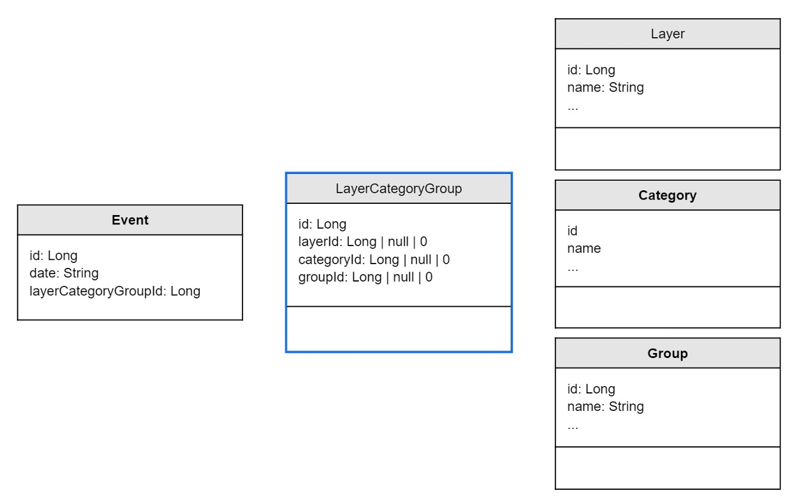

#### [План](README.md)

---

![[scheme.png|700]]



![[scheme_02.png|700]]



![[scheme_03.jpg|700]]




```js
  const layers = [
    { id: 1, title: 'Выходные' },
    { id: 2, title: 'Мероприятия Клерк' },
    { id: 3, title: 'Персональные события' },
    { id: 4, title: 'Отчетность' },
  ]

 const categories = [
    { id: 0, title: 'default' },
    { id: 1, title: 'Виды отчетности' },
    { id: 2, title: 'Контролирующий орган' },
    { id: 3, title: 'Система налогооблажения' },
  ]

 const groups = [
    { id: 1, title: 'Вебинары', layer: 2, category: 0 },
    { id: 2, title: 'Онлайн-курсы', layer: 2, category: 0 },
    { id: 3, title: 'Курсы повышения квалификации', layer: 2, category: 0 },
	
    { id: 4, title: 'Бухгалтерская и налоговая', layer: 4, category: 1 },
    { id: 5, title: 'По сотрудникам', layer: 4, category: 1 },
    { id: 6, title: 'Статистическая', layer: 4, category: 1 },
    { id: 7, title: 'Экологическая', layer: 4, category: 1 },
    { id: 8, title: 'Алкогольная', layer: 4, category: 1 },
	
    { id: 9, title: 'ПФР', layer: 4, category: 2 },
    { id: 10, title: 'РПН', layer: 4, category: 2 },
    { id: 11, title: 'ФНС', layer: 4, category: 2 },
    { id: 12, title: 'ФСС', layer: 4, category: 2 },
    { id: 13, title: 'ФСРАР', layer: 4, category: 2 },
    { id: 14, title: 'СФР', layer: 4, category: 2 },
	
    { id: 15, title: 'ОСНО', layer: 4, category: 3 },
    { id: 16, title: 'УСН', layer: 4, category: 3 },
    { id: 17, title: 'ПСН', layer: 4, category: 3 },
    { id: 18, title: 'ЕСХН', layer: 4, category: 3 },
  ]

  const events = {
    '2024-11-02': [
      { id: 1, title: 'test 1', group: 1 }, 
      { id: 2, title: 'test 2', group: 1 },
      { id: 3, title: 'test 3', group: 2 },
    ],
    '2024-11-01': [
      { id: 4, title: 'test 4', group: 5 }, 
      { id: 5, title: 'test 5', group: 3 },
      { id: 6, title: 'test 6', group: 5 },	
    ]
  }
```
