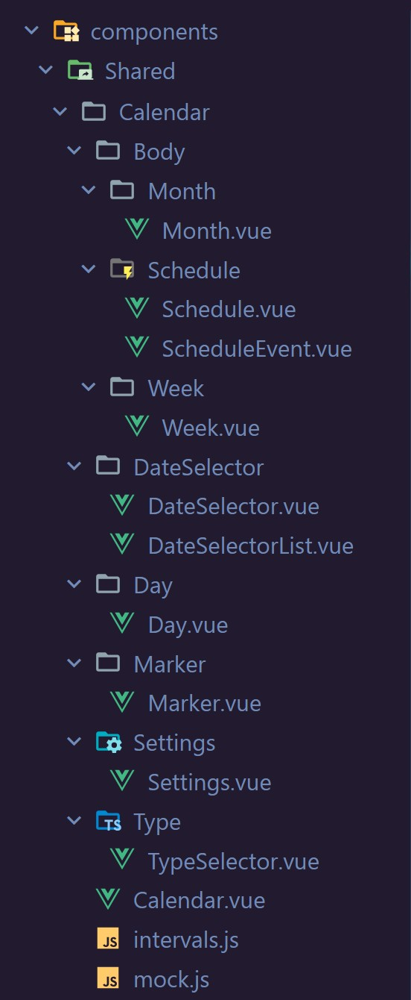

![[old_structure.jpg|280]]



#### mock дата


```js
groups: [
	{
		id: 1,
		title: 'Виды отчетности',
		color: '#316FEE',
	},
	{
		id: 2,
		title: 'Системы налогообложения',
		color: '#F05247',
	},
	{
		id: 3,
		title: 'Мероприятия',
		color: '#309D4B',
	},
]

layers: [
	{ id: 1, group: 1, title: 'ОСНО' },
	{ id: 2, group: 1, title: 'УСН' },
	{ id: 3, group: 1, title: 'ПСН' },
	{ id: 4, group: 1, title: 'ЕСХН' },
	{ id: 5, group: 2, title: 'АААА' },
	{ id: 6, group: 2, title: 'ББББ' },
	{ id: 7, group: 3, title: 'ВВВВ' },
]

days: [
	{
		date: "2024-06-24",
		events: [
			{
				description: "Уплата авансового платежа по налогу на...",
				title: "Отчет о движении средств",
				type: 7
			},
			{
				description: "Уплата авансового платежа по налогу на...",
				title: "Отчет о движении средств",
				type: 1
			}
		],
		isDayOff: false
	}
]
```

#### производственный календарь
https://www.klerk-team17.ru/tool/calendar/industrial/2024/

> Информация для производственного календаря возвращается в
> **v4/structure** https://www.klerk-team17.ru/yindex.php/v4/structure?dir=%2Ftool%2Fcalendar%2Findustrial%2F2024%2F

```js
"general": {
	"query": null,
	"contentHeader": "Производственный календарь на 2024 год...",
	"contentDescription": null,
	"entityId": 9768293,
	"commentsCount": 3,
	"favorites": 2,
	"inMyFavorites": false,
	"seoBlocks": []
},
"head": {
	"title": "Производственный календарь на 2024 год...",
	"meta": {
		"description": "Производственный календарь на...",
		"vk:app_id": 7777142,
	},
	"link": {
		"image_src": "",
		"canonical": "https://klerk-team17.ru/tool/calendar/industrial/2024/"
	}
},
"specific": {
	"id": 1,
	"name": "Производственный календарь на 2024 год...",
	"announce": "<h2>Перенос выходных дней в 2024 году</h2><p>Поста...",
	"resume": "<p><strong>Пояснения к производственному календарю...",
	"text1": "",
	"text2": "",
	"files": [
		{
			"id": 6366,
			"name": "Производственный календарь за 2024 год в формате Excel",
			"size": 70144,
			"type": "xls",
			"url": "/ugc/attachments/xls/1752f0909382353e9052.xls",
			"downloads": 0
		}
	],
	"firstQuarterText": "",
	"secondQuarterText": "",
	"thirdQuarterText": "",
	"forthQuarterText": "",
	"daysAndHours": {
		"monthly": {
			"1": {
				"days": "31",
				"weekends": 14,
				"work": 17,
				"hours": { "40": 136, "36": 122.4, "24": 81.6 },
				"weekendsList": [ 1, 2, 3, 4, 5, 6, 7, 8, 13, 14, 20, 21, 27, 28 ],
				"shortDaysList": []
			},
			"2": {
				"days": "29",
				"weekends": 9,
				"work": 20,
				"hours": { "40": 159, "36": 143, "24": 95 },
				"weekendsList": [ 3, 4, 10, 11, 17, 18, 23, 24, 25 ],
				"shortDaysList": [ 22 ]
			},
		},
		"year": {
			"hours": { "40": 1979, "36": 1780.6, "24": 1185.3 },
			"days": 366,
			"weekends": 118,
			"work": 248
		},
		"half": {
			"1": {
				"hours": { "40": 932, "36": 838.4, "24": 557.6 },
				"days": 182,
				"weekends": 65,
				"work": 117
			},
			"2": {
				"hours": { "40": 1047, "36": 942.2, "24": 627.8 },
				"days": 184,
				"weekends": 53,
				"work": 131
			}
		},
		"quarter": {
			"1": {
				"hours": { "40": 454, "36": 408.4, "24": 271.6 },
				"days": 91,
				"weekends": 34,
				"work": 57
			},
			"2": {
				"hours": { "40": 478, "36": 430, "24": 286 },
				"days": 91,
				"weekends": 31,
				"work": 60
			},
			"3": {
				"hours": { "40": 528, "36": 475.2, "24": 316.8 },
				"days": 92,
				"weekends": 26,
				"work": 66
			},
			"4": {
				"hours": { "40": 519, "36": 467, "24": 311 },
				"days": 92,
				"weekends": 27,
				"work": 65
			}
		}
	}
}
```
