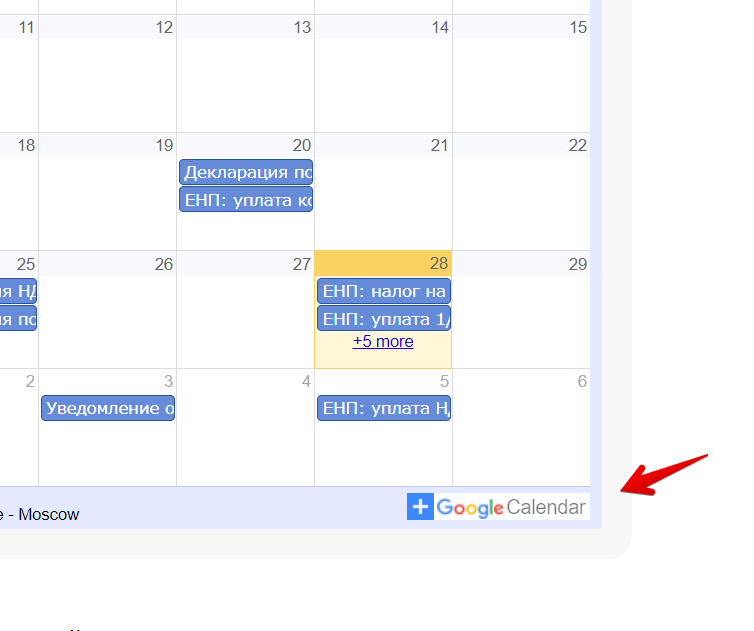

#### [План](README.md)

Нужен ли localStorage для запоминания состояния фильтров?

---

![[add_google.png|320]]

В описании задачи не вижу пункта по добавлению в гугл календарь, a на макете добавленo. Сейчас эта кнопка есть и как я понимаю, берет за основу уже существующий, вручную заполненный, гугл календарь. По-скольку мы делаем свой, для функционирования данной кнопки нужно будет реализовать синхронизацию нашего календаря с гугловским. Вопрос: это же, как я понимаю, работа для бэка, а на фронте должна приходить только ссылка?

![[old_add_google.png|400]]

